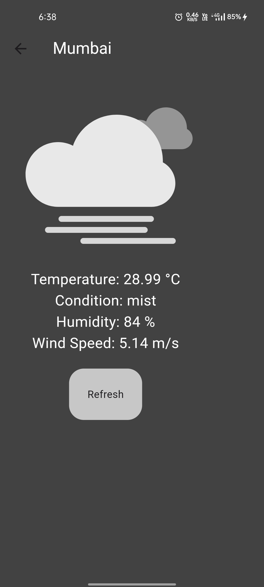

# Flutter Weather App

A simple weather app built with Flutter that displays current weather information for a given city using the OpenWeatherMap API. The app includes Lottie animations that represent the current weather conditions.

## Features

- Search for a city's weather.
- Display current temperature, weather condition, humidity percentage, and wind speed.
- Refresh button to update weather information.
- Lottie animations for different weather conditions.

## Screenshots

#### Home Screen


#### Weather Details Screen


## Getting Started

### Prerequisites

- [Flutter](https://flutter.dev/docs/get-started/install) should be installed on your local machine.
- An API key from [OpenWeatherMap](https://openweathermap.org/).

### Installation

1. **Clone the repository:**
   ```bash
   git clone https://github.com/yourusername/weather_app.git
   cd weather_app
